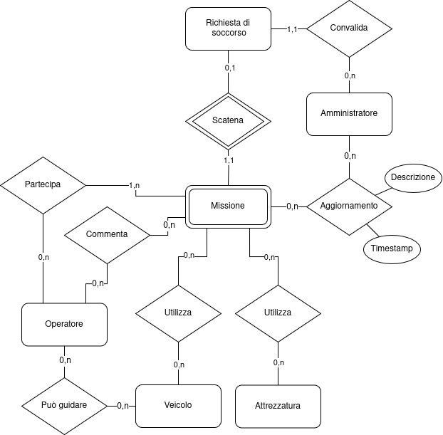

# Soccorso_Web
 Progetto di Sviluppo Web avanzato

il seguente documento non illustra l'effettiva documentazione del progetto ma piuttosto le fasi di progettazione, di conseguenza codici e grafici non saranno rispettati fedelmente ma verranno utilizzati come guida generale per modellare la specifica OpenAPI
## Base di dati
### Considerazioni

- Il segnalatore è stato rimosso e ingoblato nella richiesta di soccorso dato che l'unica sua presenza del sistema deriva dalla relazione con la richiesta, per quanto sia un attore principale nella base non ci è di acluna utilità avere una lista dei segnalatori senza l'associazione alle proprie richieste, e nella richiesta non è un problema avere le informazione del segnalatore data la mancaza di dati personali sensibili
- Dopo aver considerato l'idea di aggiungere l'entità "Patente" da associare all'operatore e ai veicoli, questa è stata scartata dato che: 
    1. Un operatore può avere una patente che è associata ad un veicolo ma essere in una zona diversa da quella in cui il veicolo è situato
    2. Un operatore può avere una patente che è associata ad un veicolo ma per scelta personale o dell'azienda non si occupa dell'utilizzo di quel determinato veicolo
    3. Risulta molto più comodo per questo scopo associare direttamente il singolo operatore ai veicoli da lui guidabili (ovviamente deve comunque avere una patente adeguata al veicolo)

### Bozza Modello ER



### Traduzione modello ER nel modello relazionale

* **Amministratore**(**<ins>ID</ins>**, username, password)
* **Operatore**(**<ins>ID</ins>**, username, password, anagrafica, patenti, abilità, disponibilità, in_missione)
* **Richiesta_di_soccorso**(**<ins>ID</ins>**,  **<ins>ID_Amministratore</ins>**, descrizione, posizione, foto, stato, nome, email,lvl_successo)
* **Missione**(**<ins>ID</ins>**, **<ins>ID_richiesta</ins>**, obiettivo, t_inizio, t_fine)
* **Attrezzatura**(**<ins>ID</ins>**, nome, descrizione)
* **Veicolo**(**<ins>ID</ins>**, nome, descrizione)
* **Aggiornamento**(**<ins>ID</ins>**, **<ins>ID_Missione</ins>**, **<ins>ID_Amministratore</ins>**, **<ins>Timestamp</ins>**, descrizione)
* **Operatore_Missione**(**<ins>ID</ins>**, **<ins>ID_Missione</ins>**, **<ins>ID_Operatore</ins>**)
* **Veicolo_Missione**(**<ins>ID</ins>**, **<ins>ID_Missione</ins>**, **<ins>ID_Veicolo</ins>**)
* **Veicolo_Operatore**(**<ins>ID</ins>**, **<ins>ID_Operatore</ins>**, **<ins>ID_veicolo</ins>**)
* **Attrezzatura_Missione**(**<ins>ID</ins>**, **<ins>ID_Missione</ins>**, **<ins>ID_Attrezzatura</ins>**)
* **Attrezzatura_Missione**(**<ins>ID</ins>**, **<ins>ID_Missione</ins>**, **<ins>ID_Attrezzatura</ins>**)

- **<ins>ID</ins>** e/o **<ins>attributo</ins>** è la chiave
- **<ins>ID_entità</ins>** è la chiave esterna
- alcuni dei nomi presenti sul diagramma sono stati abbreviati per semplicità

## RESTful
### Creazione oggetti
I seguenti oggetti sono scritti in uno pseudocodice ispirato a yaml, a scopo puramente illustrativo per modellare le operazione RESTful
* **Richiesta di Soccorso**:
```yaml
uid: string
nome: string
contatto: string
descrizione: string
posizione:
    - lat: double (-90,90)
    - long: double (-180,180)
foto: string (binary)
    default: none
stato: enum (attesa, attiva, in corso, chiusa, ignorata)
    default: attesa
uid_amministratore: string
    default: none
lvl_successo: number (0,5)
    default: 0
```
* **Operatore**:
```yaml
uid: string
username: string
password: string
anagrafica: object
patenti: [string]
    default: none
abilita: string
    default: none
disponibilita: bool
    default: false
```
* **Missione**:
```yaml
uid: string
uid_richiesta: string
obiettivo: string
posizione:
    - lat: double (-90,90)
    - long: double (-180,180)
operatori: [string(uid)]
mezzi: [string(uid)]
    default: none
attrezzi: [string(uid)]
    default: none
inizio: string($date-time)
    default: none
aggiornamenti:
    - data: string($date-time)
    - descrizione: string
    default: null
fine: string($date-time)
    default: none
commenti: [object(commento)]
    commento:
        - uid_operatore: string
        - descrizione: string
```
## URL di base del servizio

`https://{regione}.soccorsoWeb.com/rest` (di seguito indicata con [BASE])

## Operazioni
### 1. LOGIN/LOGOUT
### 1.1 Login
#### Richiesta
`POST [BASE]/auth/login`
- Header
    - Content type: application/x-www-form-urlencoded
- Payload
    - Username e Password
#### Risposta
- 200:
    - Header
        - Token di accesso
- 401/500
### 1.2 Logout
#### Richiesta
`DELETE [BASE]/auth/logout`
#### Risposta
- 204
- 401/500 
### 1.3 Refresh
#### Richiesta
`GET [BASE]/auth/refresh`
#### Risposta
- 200:
    - Header
        - Nuovo token di accesso
- 401/500


### 2 Inserimento richiesta di soccorso
#### Richiesta
`POST [BASE]/richieste`
- Header
    - Content type: application/json
- Payload
    - Oggetto json "Richiesta di Soccorso"
#### Risposta
- 201:
    - Header
        - [BASE]/richieste/{uid}
- 500

### 3 Convalida di una richiesta di soccorso 
questo endpoint deve ricevere le richieste provenienti dai click sui link di convalida descritti nella specifica.

#### Richiesta
`PATCH [BASE]/richiesta/{uid}`
- Header
    - Token di convalida
    - Content type: application/json
- Payload
    - stato = attivo
#### Risposta
- 204: No content
- 401/500

### 4 Lista delle richieste di soccorso
 Paginata e filtrata in base alla tipologia (attive, in corso, chiuse, ignorate)
#### Richiesta
`GET [BASE]/richieste?stato={stato}`
- Header
    - Accept: application/json
#### Risposta
- 200:
    - Header
        - Content type: application/json
    - Payload
        - Lista eventi
- 401/404/500

### 5 Lista delle richieste di soccorso chiuse con risultato non totalmente positivo 
#### Richiesta
`GET [BASE]/richieste?stato=chiuso&q=lvl_successo lt 5`
- Header
    - Accept: application/json
#### Risposta
- 200:
    - Header
        - Content type: application/json
    - Payload
        - Lista richieste
- 401/404/500

### 6 Lista degli operatori attualmente liberi
`GET [BASE]/operatori?disponibilità=true`
#### Richiesta
- Header
    - Accept: application/json
#### Risposta
- 200:
    - Header
        - Content type: application/json
    - Payload
        - Lista eventi
- 401/404/500

### 7 Creazione di una missione
### 7.1 Missione
`POST [BASE]/missioni`
#### Richiesta
- Header
    - Content type: application/json
- Payload
    - Oggetto json "Missione"
#### Risposta
- 201:
    - Header
        - [BASE]/missioni/{uid}
- 401/500
### 7.2 Richiesta in corso
`PATCH [BASE]/richieste/{uid}`
#### Richiesta
- Header
    - Content type: application/json
- Payload
    - stato = in corso
#### Risposta
- 204: No content
- 401/404/500

### 8 Chiusura di una missione in corso
### 8.1 Fine missione
`PATCH [BASE]/missioni/{uid}`
#### Richiesta
- Header
    - Content type: application/json
- Payload
    - fine = {Current_time}
#### Risposta
- 204: No content
- 401/404/500
### 8.2 Richiesta chiusa
`PATCH [BASE]/richieste/{uid}`
#### Richiesta
- Header
    - Content type: application/json
- Payload
    - stato = chiusa
#### Risposta
- 204: No content
- 401/404/500

### 9 Annullamento di una richiesta di soccorso
`PATCH [BASE]/richieste/{uid}`
#### Richiesta
- Header
    - Content type: application/json
- Payload
    - stato = ignorata
#### Risposta
- 204: No content
- 401/404/500

### 10 Dettagli di una missione
`GET [BASE]/missioni/{uid}`
#### Richiesta
- Header 
    - Accept: application/json
#### Risposta
- 200:
    - Header
        - Content type: application/json
    - Payload
        - oggetto missione
- 401/404/500


### 11 Dettagli una richiesta di soccorso
`GET [BASE]/richieste/{uid}`
#### Richiesta
- Header 
    - Accept: application/json
#### Risposta
- 200:
    - Header
        - Content type: application/json
    - Payload
        - oggetto richiesta di soccorso
- 401/404/500

### 12 Dettagli di un operatore
`GET [BASE]/operatori/{uid}`
#### Richiesta
- Header 
    - Accept: application/json
#### Risposta
- 200:
    - Header
        - Content type: application/json
    - Payload
        - oggetto operatore
- 401/404/500

### 13 Lista delle missioni in cui un operatore è stato coinvolto
`GET [BASE]/missioni/operatori/{uid}`
#### Richiesta
- Header 
    - Accept: application/json
#### Risposta
- 200:
    - Header
        - Content type: application/json
    - Payload
        - Lista missioni
- 401/404/500

